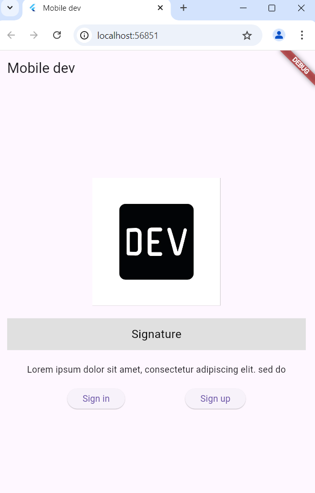
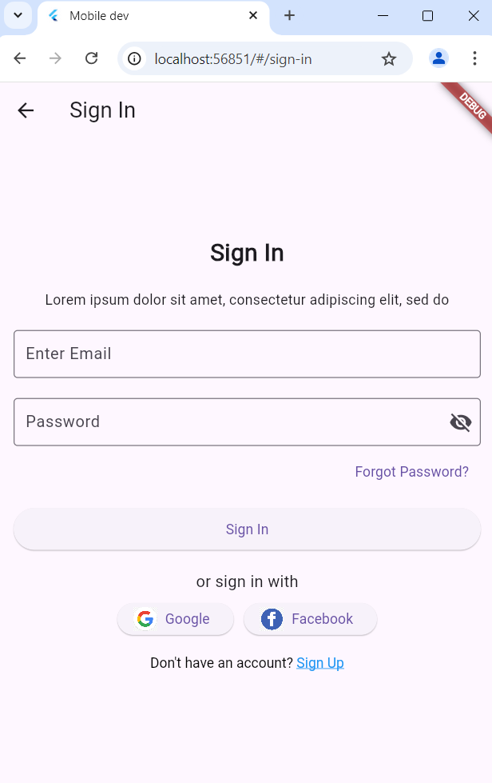
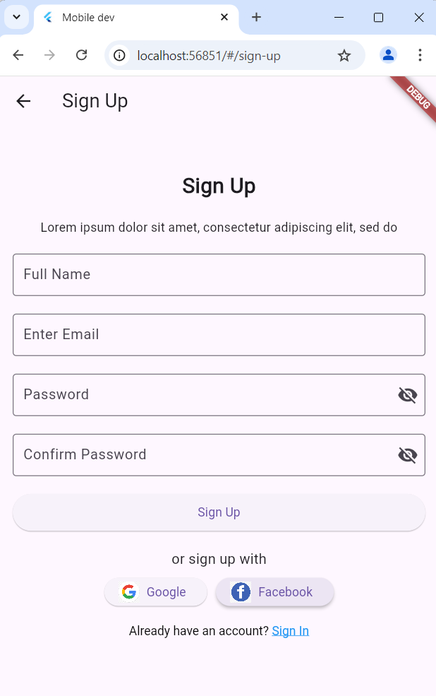

# template_project

### Nama: RIFKI HIDAYAT
### Kelas: 2D TRPL
### Nim: 362358302097

## Getting Started

1. Tampilan Pertama

- didalamnya mencakup sign-in dan sign-out

2. Tampilan Sign in

- didalamnya ada memasukkan email jika sudah terdaftar beserta password

3. Tampilan Sign out

- didalamnya ada registrasi akun dan ada notip salah password tidak sama, masih ada masalah

4. Tampilan Home

